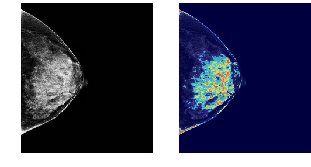
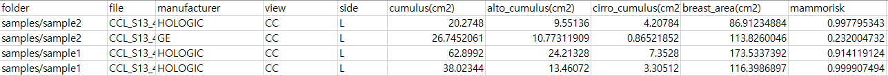

mammo2risk
==========


From mammogram to risk: A deep learning-based comprehensive mammographic biomarker assessment tool for breast cancer risk prediction.

Installation
--------

We recommend using python virtual env.
```
source activate [env_name]
git clone https://github.com/JuYoungAhn/mammo2risk
cd mammo2risk
pip install -e .
```

Command Line Interface
--------

```
mammo2risk --f [file_path] --d [directory_path] --o [outputpath] --w [config_path] --r --save
```

### Parameters
Either --d or --f option is mandatory.

```
--d : Directory path (string) [Default: current directory]
--f : File path (string)
--o : Output path (string, optional) [Default: current path]
--w : configuration file path (string, optional) [Default : ~/mammo2risk/weights]
--r  :  If folder has subdirectories (flag, optional)
--save : save density map (flag, optional)
```

Usage Example
--------

### Environment
- Input directory : ~/samples
- Two subdirectories : ~/samples/sample1, ~/samples/sample2
- Each subdirectories has 2 dicom files (--r option).
- Config files saved in ~/mammo2risk/weights
- Save density maps.

```
mammo2risk --d ~/samples  --o ~/result  --w ~/mammo2risk/weights --r --save
```
### Outputs
#### (1) ~/result/density_map/[file_name].jpg


#### (2) ~/result/mammo2risk.csv


Weight files
--------
- Please contact author to use weight files (juyoung.ahn@snu.ac.kr).
- In --w option, config file (.json) and weights files (.h5) path shoule be specified.
- If you do not want to write --w option at each time, save both files in [~/mammo2risk/weights].

Features
--------

* Free software: MIT license
* Documentation: https://mammo2risk.readthedocs.io.

Credits
-------

This package was created with Cookiecutter and the `audreyr/cookiecutter-pypackage` project template.
- Cookiecutter: https://github.com/audreyr/cookiecutter
